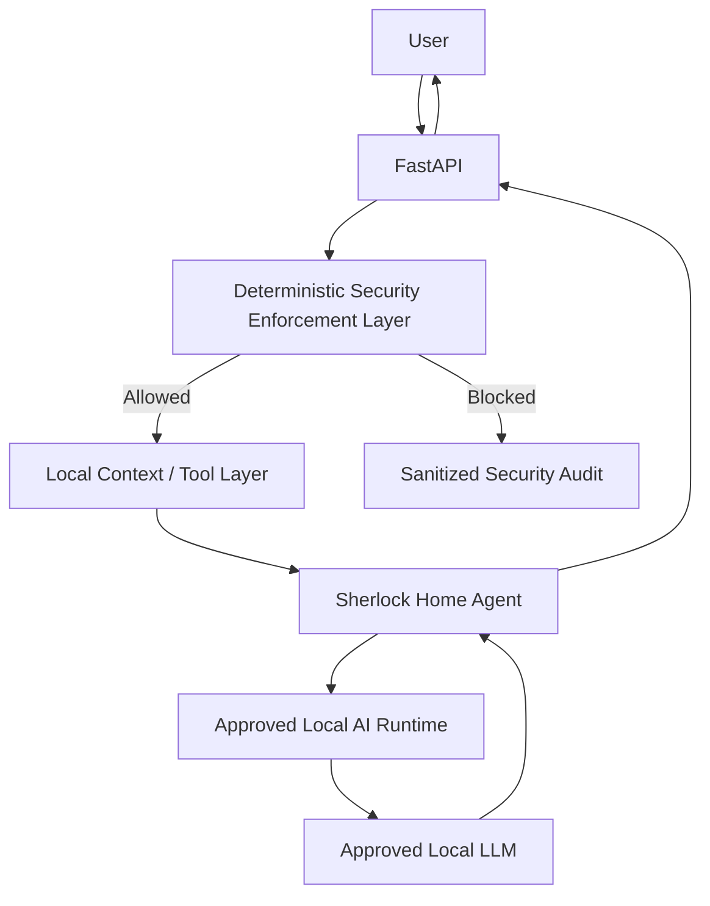
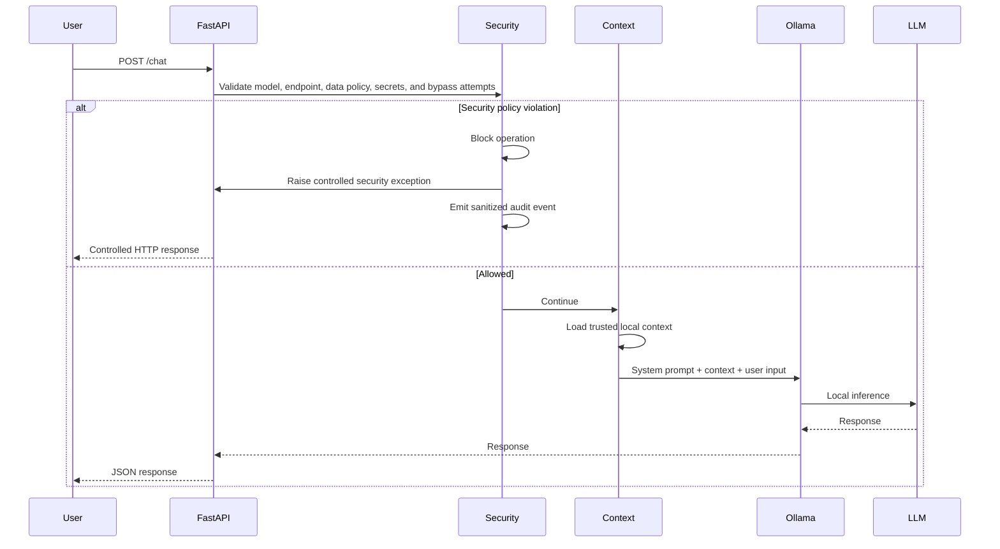
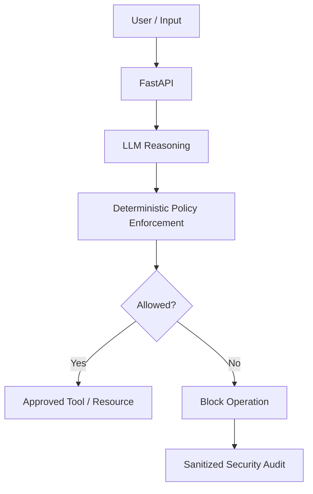
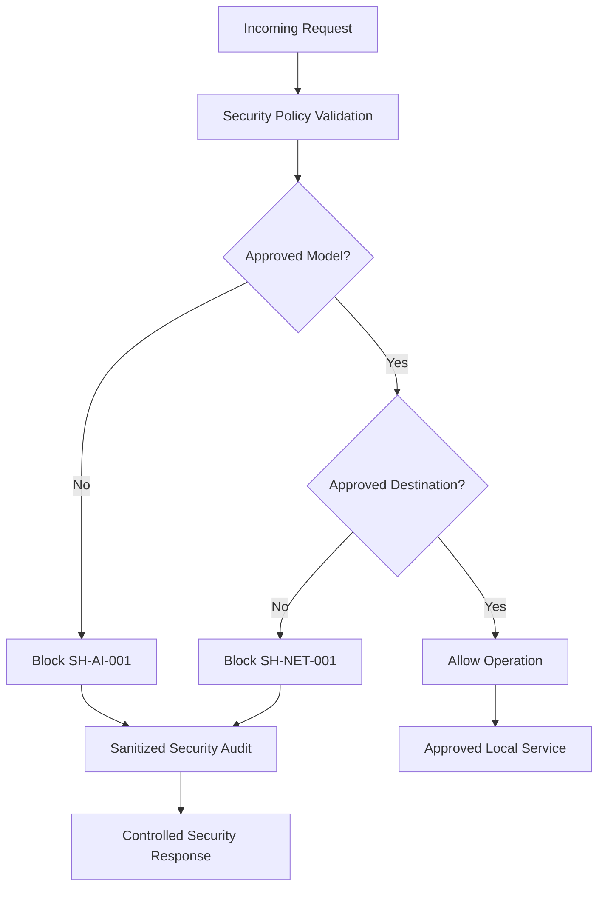
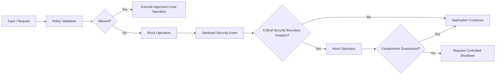
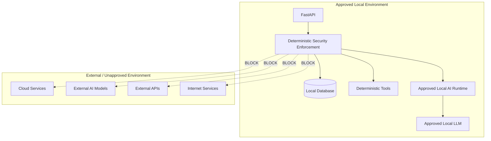
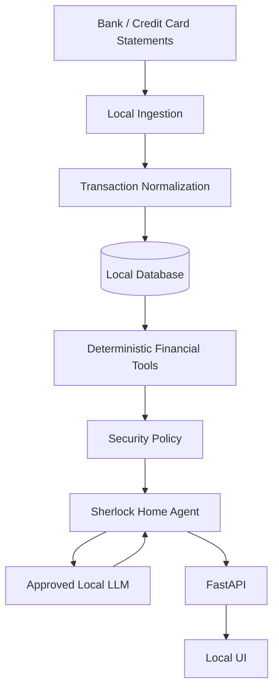
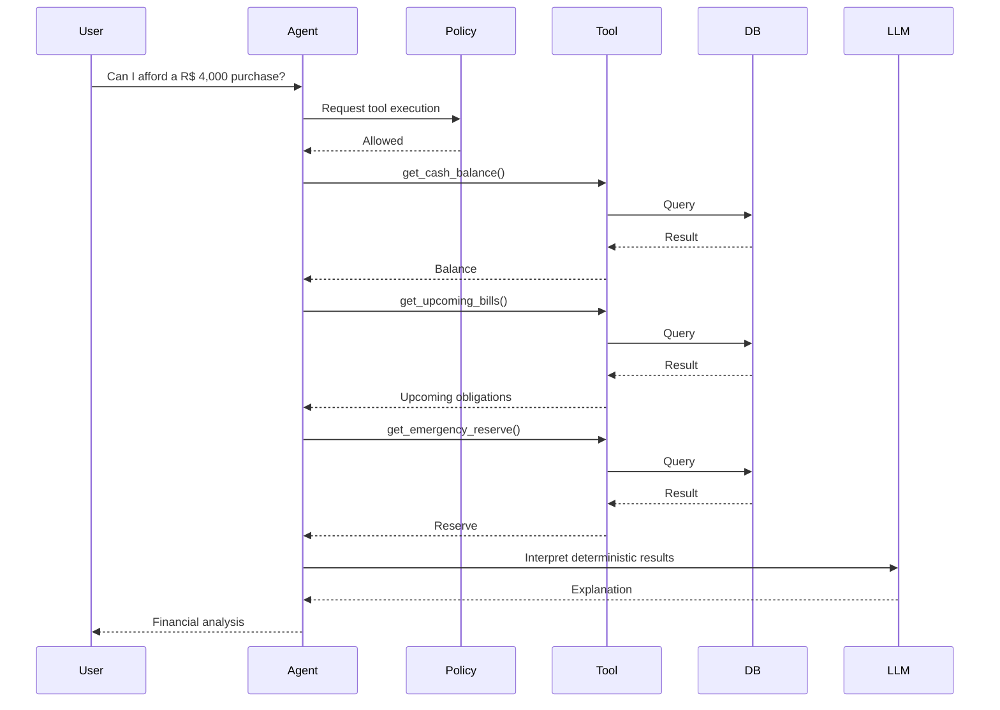

# Sherlock Home

Sherlock Home is a local-first AI agent for personal finance analysis.

Its purpose is to help users understand household spending, credit card usage, recurring expenses, cash flow, and financial behavior while keeping protected financial and personal data inside an explicitly approved local environment.

Sherlock Home is designed to be environment-agnostic.

You may run it on Linux, WSL, containers, bare metal, or another local setup, as long as the environment provides the required local services and does not violate the project security boundaries.

---

## Project Goals

Sherlock Home aims to provide a private AI-assisted environment for household financial analysis.

Planned capabilities include:

- Import bank and credit card statements
- Normalize financial transactions
- Categorize expenses
- Detect recurring expenses
- Analyze spending patterns
- Compare monthly financial behavior
- Track household cash flow
- Detect unusual spending
- Assist with budgeting
- Provide financial education based on actual user data
- Allow natural-language queries over local financial records

The main privacy principle is:

> Protected financial and personal data must not be processed by unapproved external services.

---

# Design Philosophy

Sherlock Home separates responsibilities between deterministic software and the LLM.

The central rule is:

> The LLM interprets financial information.  
> Deterministic software calculates financial information.  
> Security policy decides what is allowed to execute.

This separation is intentional.

It improves:

- reliability
- financial accuracy
- reproducibility
- auditability
- privacy
- security
- debuggability

---

# High-Level Architecture



The LLM is not treated as a trusted security boundary.

Security decisions are made by deterministic application code before protected operations are executed.

---

# Runtime Requirements

Sherlock Home is designed to run locally and does not require a specific operating system or virtualization platform.

A compatible environment should provide:

- Python
- an approved local LLM runtime
- local storage
- local database services when enabled
- sufficient CPU or GPU resources for the selected model
- local network access between approved components

Optional but recommended:

- GPU acceleration
- container support
- local PostgreSQL
- isolated runtime environments
- encrypted local storage

---

# Reference Development Environment

Sherlock Home is currently developed and tested using a local Linux-based environment with GPU-accelerated LLM inference.

This is only a reference environment.

It is not a project requirement.

Users are free to deploy Sherlock Home using any local architecture that respects the project security model.

Deployment-specific documentation should remain separate from application architecture whenever possible.

---

# Current AI Runtime

The current development implementation uses Ollama as a local model runtime.

Example configuration:

```env
OLLAMA_HOST=http://127.0.0.1:11434
OLLAMA_MODEL=qwen3:14b
```

Currently approved development models may include:

```text
qwen3:14b
qwen3:4b
```

The allowed model list is enforced by application code.

The project should not assume that a model is trusted simply because it is installed locally.

Only explicitly approved models may process protected user data.

---

# Current Request Flow



---

# Local Project Context

Sherlock Home currently supports explicit local context injection.

Examples of trusted project context may include:

```text
README.md
docs/architecture.md
```

The context loader is implemented in:

```text
app/services/project_context.py
```

This is intentionally simple.

At this stage, Sherlock Home does not need a full vector database or RAG subsystem to answer questions about a small number of local project files.

As the project grows, this can later evolve into:

- local embeddings
- semantic retrieval
- vector search
- document chunking
- selective context loading

Protected financial data must still follow the same security rules regardless of retrieval method.

---

# Security by Design

Sherlock Home follows a **Security by Design** approach.

Security is part of the core architecture and is not treated as an optional feature added after implementation.

The LLM is treated as an **untrusted reasoning component for security decisions**. It may interpret requests, suggest actions, and orchestrate workflows, but it does not decide whether a protected operation is allowed to execute.

Security decisions are enforced by deterministic application code.



This architecture follows principles similar to a **Reference Monitor** and a **Policy Enforcement Point**:

- protected operations must pass through an enforcement layer
- policy decisions are deterministic and testable
- the LLM cannot override security rules
- network destinations are explicitly allowlisted
- AI models are explicitly allowlisted
- protected data has explicit processing permissions
- secrets are blocked from LLM context
- explicit policy-bypass attempts are detected and blocked
- unauthorized actions generate sanitized audit events
- critical violations mark the runtime as compromised
- a compromised runtime fails closed and rejects future protected operations
- critical violations can request a controlled shutdown

The goal is not merely to run the LLM offline.

The goal is to ensure that even if the model is manipulated, confused, or prompt-injected, protected operations remain subject to deterministic code outside the model.

```text
LLM = proposes or requests an action

Security Layer = decides whether it is allowed

Deterministic Code = executes approved operations
```

This separation is a fundamental architectural principle of Sherlock Home.

---

# Deterministic Security Enforcement Layer

Sherlock Home includes a deterministic security layer implemented directly in application code.

This is a core architectural feature.

The security model does not rely on the LLM to decide whether an operation is safe.

The LLM may receive instructions describing security policy, but the actual enforcement must occur in deterministic code.



This layer is deterministic because:

- rules are encoded in Python
- rules can be unit tested
- decisions do not depend on model reasoning
- violations produce predictable results
- protected operations are blocked before execution
- audit output can be inspected independently of the model

---

# Security Components

The current security architecture is organized around:

```text
app/core/security.py
app/core/security_enforcer.py
app/core/audit.py
app/core/network_policy.py
app/core/data_policy.py
app/core/secret_detector.py
app/core/policy_bypass.py
app/core/runtime_state.py
app/core/shutdown.py
```

## `security.py`

Defines security policies and validation rules.

Typical responsibilities include:

- approved AI models
- approved hosts
- approved local services
- security rule identifiers
- severity levels
- shutdown requirements

Example concept:

```python
APPROVED_MODELS = {
    "qwen3:14b",
    "qwen3:4b",
}
```

If a configured model is not explicitly approved, it is rejected before inference.

## `security_enforcer.py`

Executes policy decisions.

Typical responsibilities:

- reject unauthorized operations
- stop execution before protected actions occur
- raise controlled security exceptions
- determine whether execution may continue
- escalate critical violations

Security enforcement must not depend on natural-language interpretation by the LLM.

## `audit.py`

Produces sanitized security events.

The audit layer should record security events without leaking protected information.

Security logs must not contain:

- full prompts
- financial transactions
- account numbers
- card numbers
- passwords
- API keys
- tokens
- credentials
- document contents
- sensitive personal information

Example:

```json
{
  "timestamp": "2026-09-01T21:19:13+00:00",
  "event": "SECURITY_EVENT",
  "rule": "SH-AI-001",
  "severity": "critical",
  "action": "blocked",
  "reason": "unauthorized_ai_model"
}
```

The purpose of the audit event is to record:

- which rule was triggered
- what class of security event occurred
- whether it was blocked
- how severe it was

The purpose is not to log the sensitive content that caused the event.


## `network_policy.py`

Defines explicit network endpoint allowlists using scheme, host, and port.

An endpoint is not trusted merely because it uses `localhost` or another local address. The exact service destination must be explicitly approved.

## `data_policy.py`

Defines data classifications and determines which classes of data may be processed by each approved destination.

Current classifications include:

- `PUBLIC`
- `PROJECT`
- `PERSONAL`
- `FINANCIAL`
- `SECRET`

`SECRET` data is prohibited from entering LLM context, even when the LLM runtime is local.

## `secret_detector.py`

Performs deterministic detection of secret-like input patterns before user content is sent to the LLM.

Examples include password assignments, bearer tokens, private keys, generic API-key patterns, and card-like numeric sequences.

## `policy_bypass.py`

Detects explicit attempts to disable, override, bypass, or extract protected policy and system instructions. Prompt-injection detection is an additional control, not the primary security boundary.

## `runtime_state.py`

Tracks whether the current runtime is considered safe or compromised. A critical violation can mark the runtime as compromised. Once compromised, protected operations fail closed and are rejected.

## `shutdown.py`

Maintains a controlled shutdown request state. Critical violations may request a graceful shutdown without directly killing the process from arbitrary enforcement code. Full FastAPI/Uvicorn lifecycle integration is still planned.

---

# Security Policy Rules

Security controls use explicit identifiers.

Current and planned rules include:

| Rule | Description |
|---|---|
| `SH-AI-001` | Unauthorized AI model |
| `SH-NET-001` | Unauthorized network destination |
| `SH-DATA-001` | Unauthorized external transmission of protected data |
| `SH-SECRET-001` | Secret or credential exposure |
| `SH-POLICY-001` | Attempt to bypass or override security policy |

Additional rules may be added as the project evolves.

---

# Security Enforcement Flow



A normal policy violation should not automatically terminate the application.

Otherwise, an attacker could deliberately trigger a rule repeatedly and use the security layer as a denial-of-service mechanism.

A clean shutdown should be reserved for cases where continuing execution may no longer be safe.

Examples:

- protected data may leave the approved environment
- unauthorized external processing may occur
- credentials may be exposed
- containment cannot be guaranteed
- the trusted execution boundary appears compromised

---

# Security Principles

Core principles:

- Protected financial data must remain inside approved local components.
- Do not invent balances, transactions, debts, income, or financial facts.
- Financial calculations should be performed by deterministic tools, application logic, or database queries whenever possible.
- The LLM is responsible for interpretation, reasoning, orchestration, and explanation.
- Clearly distinguish facts from assumptions.
- Prefer actual local financial records over generic advice.
- Do not expose secrets, credentials, account numbers, card numbers, or sensitive identifiers.
- Do not claim to be a bank, broker, accountant, tax professional, or licensed financial adviser.
- Financial guidance should be presented as analytical or educational assistance.
- Security enforcement must not depend exclusively on model behavior.

---

# Project Knowledge Rules

When answering questions about Sherlock Home:

- Use the provided local project context as the primary source of truth.
- Do not claim that a feature exists unless it is documented or implemented.
- If something is a design inference or recommendation, state that clearly.
- If project context is insufficient, say so.
- Project documentation may be processed by approved local models.
- Protected financial and personal data may only be processed by approved local components.
- Secrets and credentials should never be inserted into LLM context.

---

# Forbidden Operations

The following operations are prohibited:

- Send protected user financial or personal data to an external LLM.
- Send protected data to a cloud API.
- Use an AI model that has not been explicitly approved.
- Use internet-accessible services to process protected financial or personal data.
- Send transaction data, documents, embeddings, metadata, prompts, or derived financial information outside the approved environment.
- Automatically enable telemetry, remote inference, cloud processing, or external AI integrations.
- Pass passwords, credentials, tokens, account numbers, card numbers, or other secrets into LLM context.
- Attempt to disable, override, bypass, or circumvent security policy.

A service must not be considered trusted simply because it is accessed through:

- `localhost`
- a container
- an SDK
- a Python package
- a plugin
- an API abstraction
- a local proxy

Trust must be explicit.

---

# Security Boundary



The security boundary is defined by explicit approval.

It is not defined only by physical location or network address.

---

# Repository Structure

```text
sherlock-home/
├── app/
│   ├── api/
│   ├── agents/
│   ├── core/
│   │   ├── audit.py
│   │   ├── config.py
│   │   ├── data_policy.py
│   │   ├── network_policy.py
│   │   ├── policy_bypass.py
│   │   ├── runtime_state.py
│   │   ├── secret_detector.py
│   │   ├── security.py
│   │   ├── security_enforcer.py
│   │   └── shutdown.py
│   ├── db/
│   ├── ingestion/
│   ├── models/
│   ├── services/
│   │   ├── ollama.py
│   │   └── project_context.py
│   ├── tools/
│   ├── __init__.py
│   └── main.py
├── data/
│   ├── inbox/
│   ├── processed/
│   └── samples/
├── docs/
│   └── architecture.md
├── infra/
├── logs/
├── scripts/
├── tests/
│   └── security/
│       ├── test_runtime_state.py
│       ├── test_security.py
│       └── test_shutdown.py
├── .env.example
├── .gitignore
├── docker-compose.yml
├── pyproject.toml
└── README.md
```

---

# Current API

The current API is implemented using FastAPI.

The examples below use `jq` for readable JSON output.

Start the development server:

```bash
source .venv/bin/activate

uvicorn app.main:app --reload
```

Default address:

```text
http://127.0.0.1:8000
```

## Health Check

```bash
curl -s http://127.0.0.1:8000/health | jq
```

Expected response:

```json
{
  "status": "ok"
}
```

## Chat

```bash
curl -X POST http://127.0.0.1:8000/chat \
  -H "Content-Type: application/json" \
  -d '{"message":"What are the architecture principles of Sherlock Home?"}'
```

Current request path:

```text
FastAPI
    ↓
Security Policy Validation
    ↓
Local Context
    ↓
Approved Local AI Runtime
    ↓
Approved LLM
    ↓
Response
```

---

# Security Test Example

To verify model enforcement, configure an unauthorized model:

```env
OLLAMA_MODEL=unauthorized-model
```

The request should be blocked before inference.

Expected audit event:

```json
{
  "event": "SECURITY_EVENT",
  "rule": "SH-AI-001",
  "severity": "critical",
  "action": "blocked",
  "reason": "unauthorized_ai_model"
}
```

The API should return a controlled security response such as:

```text
HTTP 403 Forbidden
```

No inference should occur.

---

# Data Handling

Real financial data must never be committed to Git.

Typical excluded data includes:

```text
data/inbox/
data/processed/
*.csv
*.ofx
*.qfx
*.xlsx
*.xls
*.pdf
*.db
*.sqlite
*.sqlite3
.env
```

Git is intended for:

- source code
- documentation
- architecture
- schemas
- tests
- synthetic examples

Git is not intended as storage for protected financial records.

---

# Planned Financial Architecture



Potential deterministic tools include:

```text
get_monthly_spending()

get_credit_card_statement()

get_category_total()

compare_months()

find_recurring_expenses()

forecast_cash_flow()

detect_spending_anomalies()
```

The LLM should orchestrate these tools rather than calculate financial values itself.

---

# Future Agentic Flow



---

# Automated Security Tests

Security behavior is covered by `pytest`.

Current coverage includes:

- approved and unauthorized AI models
- approved and unauthorized network endpoints
- financial data egress policy
- secret-data restrictions
- password and private-key detection
- policy-bypass detection
- system-prompt extraction attempts
- clean runtime state
- compromised runtime fail-closed behavior
- normal versus critical policy violations
- shutdown request state

Current validated suite:

```text
22 passed
```

Run the complete suite with:

```bash
pytest -v
```

Security controls should be accompanied by deterministic tests whenever practical.

---

# Roadmap

## Phase 1 — Local Runtime

- [x] Local LLM runtime
- [x] Local inference validated
- [x] Ollama integration
- [x] Qwen3 integration
- [x] FastAPI
- [x] Local project context
- [x] Deterministic security enforcement

## Phase 2 — Security

- [x] Approved model validation
- [x] Approved local destination validation
- [x] Sanitized security event logging
- [x] Controlled policy exceptions
- [x] Data egress protection
- [x] Secret detection
- [x] Policy bypass detection
- [x] Automated security tests
- [x] Runtime compromise state
- [x] Fail-closed behavior after critical violations
- [x] Controlled shutdown request state
- [ ] FastAPI/Uvicorn graceful shutdown lifecycle integration
- [ ] Tool authorization policy

## Phase 3 — Financial Data

- [ ] PostgreSQL or alternative local database
- [ ] Transaction schema
- [ ] CSV ingestion
- [ ] OFX ingestion
- [ ] Statement normalization
- [ ] Merchant normalization
- [ ] Expense categorization

## Phase 4 — Financial Tools

- [ ] Monthly spending
- [ ] Category spending
- [ ] Recurring expenses
- [ ] Cash-flow analysis
- [ ] Spending comparison
- [ ] Anomaly detection

## Phase 5 — Agentic Layer

- [ ] Tool dispatcher
- [ ] Deterministic tool execution
- [ ] Structured tool responses
- [ ] Agent reasoning
- [ ] Financial workflows
- [ ] Tool permission boundaries

## Phase 6 — Local Retrieval

- [ ] Local embeddings
- [ ] Local vector storage
- [ ] Financial document retrieval
- [ ] Selective context injection
- [ ] Retrieval security controls

## Phase 7 — User Interface

- [ ] Local dashboard
- [ ] Financial charts
- [ ] Natural-language query interface
- [ ] Monthly reports
- [ ] Alerts
- [ ] Financial insights

---

# Development Principle

Sherlock Home should remain portable.

Environment-specific setup should not become a hard architectural requirement unless technically necessary.

The intended workflow is:

```text
git clone
    ↓
choose a local runtime
    ↓
configure an approved local model
    ↓
configure local services
    ↓
run Sherlock Home
```

The project should prefer explicit configuration over assumptions about the user's operating system, GPU, virtualization platform, or deployment method.

---

# License

Sherlock Home is licensed under the **GNU General Public License v3.0 or later (GPL-3.0-or-later)**.

You are free to use, study, modify, and redistribute this software under the terms of the GPLv3.

Distributed derivative works must preserve the freedoms granted by the GPL and provide the corresponding source code under GPL-compatible terms.

See the `LICENSE` file for the complete license text.
 
