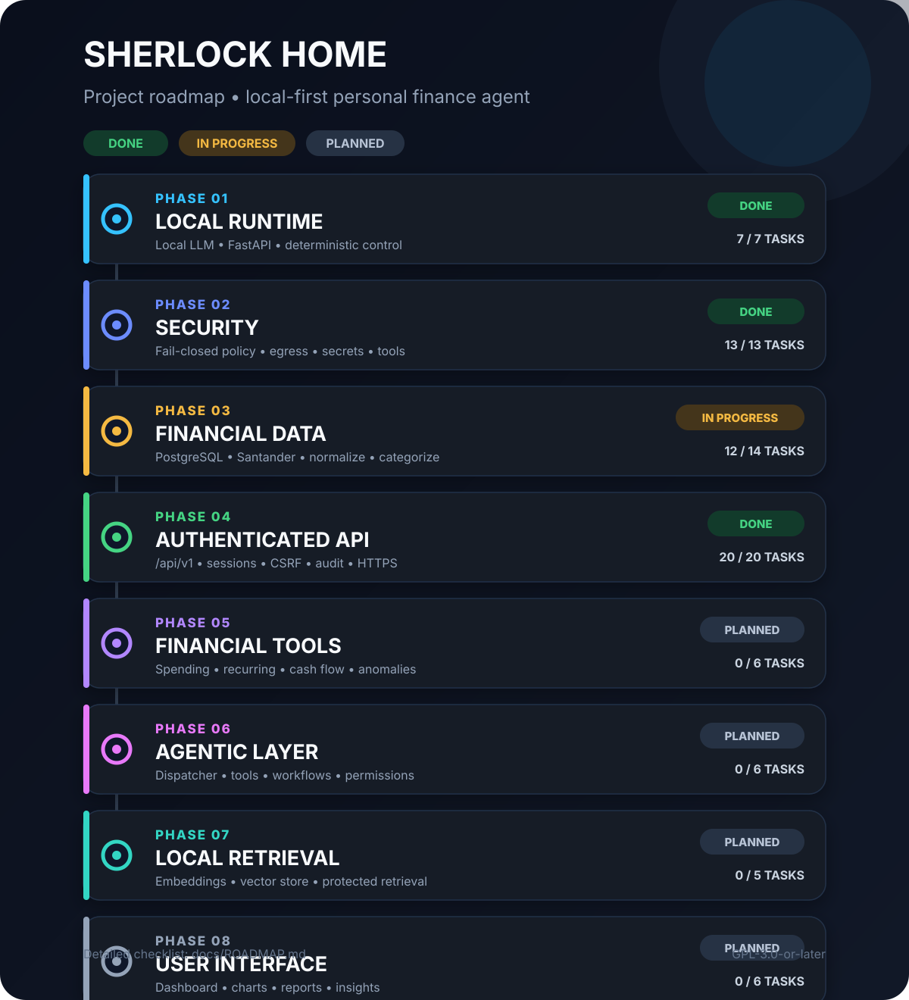

# Sherlock Home Roadmap

This document is the source of truth for Sherlock Home development phases.

The README intentionally contains only a concise project overview. This file tracks completed work, remaining work, and the intended order of future capabilities.



## Status Legend

- **DONE** — the planned scope for the phase is implemented and validated.
- **IN PROGRESS** — core capability exists, but listed work remains.
- **NEXT** — the next major implementation phase.
- **PLANNED** — not yet started as a dedicated project phase.

---

## Phase 1 — Local Runtime — DONE

- [x] Local LLM runtime
- [x] Local inference validated
- [x] Ollama integration
- [x] Qwen3 integration
- [x] FastAPI
- [x] Local project context
- [x] Deterministic security enforcement

**Outcome:** Sherlock Home can run locally with an approved local LLM while deterministic application code remains in control of protected behavior.

---

## Phase 2 — Security — DONE

- [x] Approved model validation
- [x] Approved local destination validation
- [x] Sanitized security event logging
- [x] Controlled policy exceptions
- [x] Data egress protection
- [x] Secret detection
- [x] Policy bypass detection
- [x] Automated security tests
- [x] Runtime compromise state
- [x] Fail-closed behavior after critical violations
- [x] Controlled shutdown request state
- [x] FastAPI/Uvicorn graceful shutdown lifecycle integration
- [x] Tool authorization policy

**Outcome:** the LLM is not a security authority. Deterministic policy decides whether protected operations may execute.

---

## Phase 3 — Financial Data — IN PROGRESS

- [x] Local PostgreSQL database
- [x] SQLAlchemy integration
- [x] Alembic migrations
- [x] Transaction schema
- [x] Santander PDF statement ingestion
- [x] Transaction fingerprinting
- [x] Idempotent statement import
- [x] Statement normalization
- [x] Transaction typing
- [x] Category taxonomy and deterministic rule priority
- [x] Merchant normalization
- [x] Expense categorization
- [ ] CSV ingestion
- [ ] OFX ingestion

**Outcome so far:** a deterministic end-to-end Santander ingestion pipeline persists normalized, typed, categorized transactions without duplicate imports.

**Remaining scope:** add format-level ingestion paths for CSV and OFX without weakening the canonical normalization and safety boundaries.

These adapters are not blockers for Phase 5 because the existing canonical data path is sufficient for deterministic financial analysis.

---

## Phase 4 — Authenticated Local API — DONE

- [x] Define `/api/v1` router boundary
- [x] Add single-household user model
- [x] Add server-side session model
- [x] Add local admin bootstrap workflow
- [x] Add Argon2id password hashing
- [x] Add login/logout/me endpoints
- [x] Add secure `__Host-`, HttpOnly, SameSite session cookies
- [x] Add CSRF protection
- [x] Add source-aware login rate limiting/backoff
- [x] Add authentication dependency
- [x] Add authorization dependency
- [x] Add OpenAPI security scheme
- [x] Add 401/403 security tests
- [x] Add category-rule management endpoints
- [x] Add merchant-alias management endpoints
- [x] Add opaque public IDs for configuration resources
- [x] Add persistent protected configuration audit events
- [x] Add session TTL, idle timeout, revocation, logout-all, and password rotation
- [x] Document private HTTPS deployment
- [x] Prepare UI-facing API contract

Additional validated hardening:

- [x] Generic authentication failures for unknown/disabled users
- [x] Argon2 dummy verification to reduce username timing leakage
- [x] Session cleanup service
- [x] Atomic configuration mutation + audit persistence
- [x] OpenAPI contract regression tests
- [x] Manual HTTPS authentication/session validation
- [x] Manual login throttling/backoff validation

**Validated baseline:** `195 passed`.

**Outcome:** Sherlock Home has a versioned, authenticated, CSRF-protected, audited API suitable for a future same-origin household UI over private HTTPS.

---

## Phase 5 — Financial Tools — DONE

- [x] Monthly spending
- [x] Category spending
- [x] Spending comparison
- [x] Recurring expenses
- [x] Cash-flow analysis
- [x] Anomaly detection

Implemented deterministic service functions:

```text
get_monthly_spending()
get_category_spending()
compare_monthly_spending()
find_recurring_expenses()
get_cash_flow()
detect_spending_anomalies()
```

**Validated project baseline after Phase 5:**

```text
234 passed
```

**Outcome:** persisted canonical transactions can now be analyzed through deterministic, structured, API-independent financial primitives without giving the LLM direct database arithmetic responsibility.

Detailed implementation: [`financial-tools.md`](financial-tools.md).

---

## Phase 6 — Agentic Layer — NEXT

- [ ] Tool registry
- [ ] Tool dispatcher
- [ ] Deterministic tool execution
- [ ] Structured tool responses
- [ ] Agent reasoning
- [ ] Financial workflows
- [ ] Tool permission boundaries

**Goal:** allow the local LLM to reason over approved deterministic tools without allowing the model to bypass authorization, issue arbitrary SQL, or replace deterministic financial calculations.

### Recommended implementation order

```text
1. define financial tool registry/contracts
2. implement tool dispatcher
3. connect existing deterministic tool authorization
4. serialize structured financial-tool results
5. add agent orchestration over approved tools
6. add financial workflows
7. validate permission and prompt-injection boundaries
```

---

## Phase 7 — Local Retrieval — PLANNED

- [ ] Local embeddings
- [ ] Local vector storage
- [ ] Financial document retrieval
- [ ] Selective context injection
- [ ] Retrieval security controls

**Goal:** enable retrieval over local protected material without sending household information to external embedding or retrieval services.

---

## Phase 8 — User Interface — PLANNED

- [ ] Local dashboard
- [ ] Financial charts
- [ ] Natural-language query interface
- [ ] Monthly reports
- [ ] Alerts
- [ ] Financial insights

**Goal:** provide a private household-facing interface over the authenticated API.

---

## Current Development Frontier

The next implementation target is:

```text
Phase 6
    ↓
Agentic Layer
    ↓
Tool registry / dispatcher
    ↓
Deterministic tool authorization
    ↓
Structured financial-tool execution
```

Two ingestion extensions remain independently open in Phase 3:

```text
CSV ingestion
OFX ingestion
```

They can be implemented as parser/input adapters as long as they feed the same canonical deterministic financial pipeline.

## Architectural Invariants

Future phases must preserve these rules:

1. Sherlock Home remains **single-household**, not public multi-tenant SaaS.
2. Protected household data remains local/private.
3. External LLMs, embeddings, analytics, telemetry, advertising, profiling, training, or evaluation must not receive protected household data.
4. The LLM may propose, interpret, and explain; deterministic code authorizes and executes.
5. Authentication, authorization, CSRF, session handling, financial calculations, and security decisions remain outside LLM control.
6. Public-cloud deployments, if used, remain private-network/VPN-only with no direct public application ingress.
7. PostgreSQL and the local model runtime remain private application dependencies.
8. New bank/statement formats must be isolated behind deterministic ingestion adapters.
9. Financial-tool arithmetic must use deterministic code and fixed-precision monetary values.
10. Derived analytical results must be reproducible from persisted canonical transactions and explicit query parameters.
11. Agentic execution must use an approved tool registry rather than arbitrary code, SQL, shell, or unrestricted Python execution.
