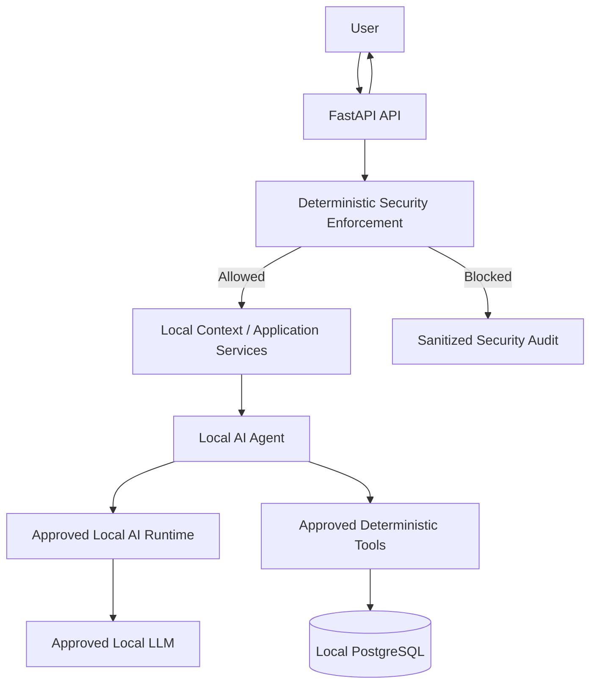
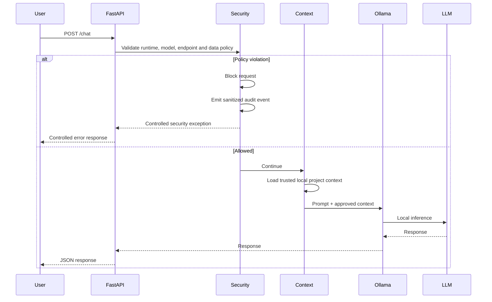
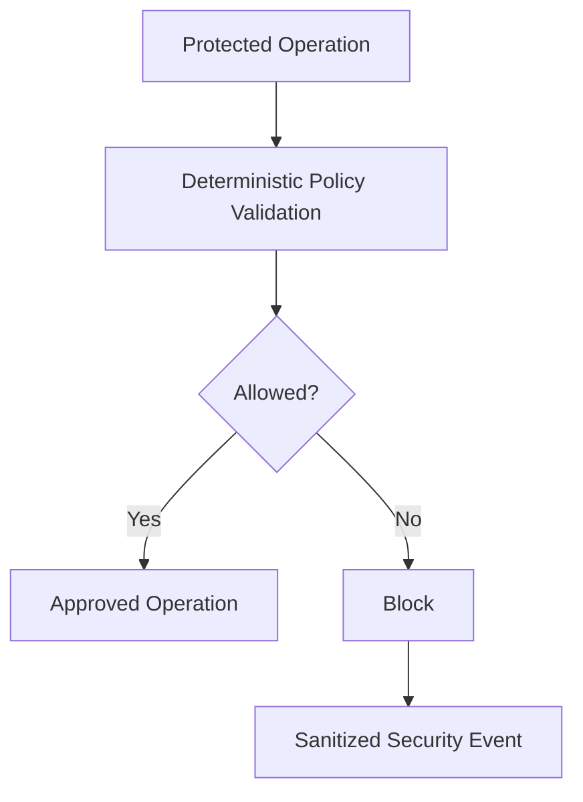
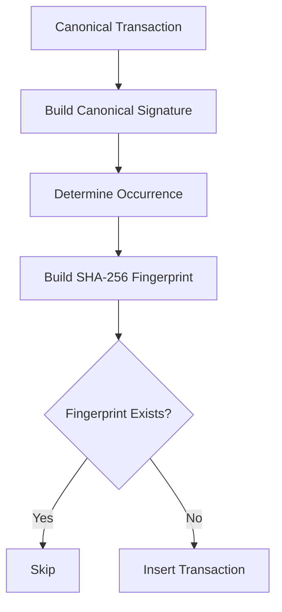
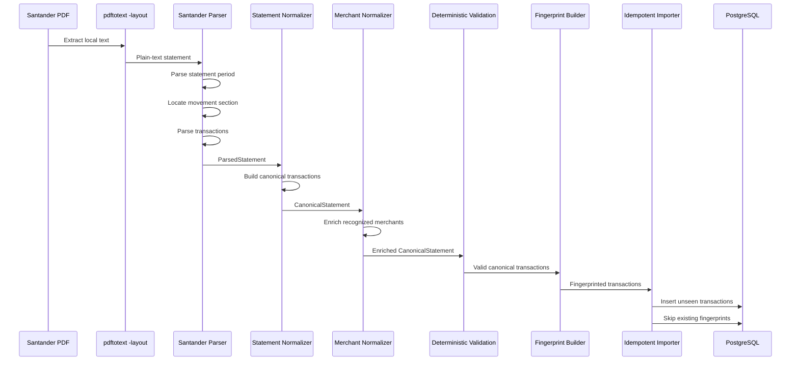

# Sherlock Home Architecture

Sherlock Home is a local-first AI agent for personal finance analysis.

Its architecture is designed around three core principles:

1. **Protected financial and personal data remains inside explicitly approved local boundaries.**
2. **The LLM is not trusted to make security decisions or perform deterministic financial calculations.**
3. **External data formats are isolated behind source-specific parsers before entering the internal financial model.**

This document describes the current implemented architecture and the boundaries that guide future development.

---

## 1. Architectural Overview

Sherlock Home separates the system into distinct layers:



The key separation is:

```text
LLM
  interprets and reasons

Deterministic application code
  validates, calculates, parses, and executes

Security policy
  decides whether protected operations are allowed
```

The LLM is therefore treated as an **untrusted reasoning component for security decisions**.

---

## 2. Main Runtime Components

The current development architecture contains the following primary components:

```text
FastAPI
Ollama
Qwen3
Deterministic security layer
Local project context loader
PostgreSQL
SQLAlchemy
Alembic
Financial statement parsers
Canonical statement normalization
Idempotent transaction importer
Automated test suite
```

The current reference development environment runs locally, but the application architecture should remain environment-agnostic.

Sherlock Home should be deployable in any compatible local environment that respects the same security boundaries.

---

## 3. API and Local AI Flow

The current request path for local AI interaction is:



The AI runtime is local.

The current approved development models include:

```text
qwen3:14b
qwen3:4b
```

Model allowlisting is enforced by deterministic application code.

---

## 4. Security by Design

Security is part of the core architecture rather than an optional layer added after implementation.

Sherlock Home follows principles similar to a:

- Reference Monitor
- Policy Enforcement Point
- Fail-closed security model
- Least-privilege architecture

Protected operations must pass through deterministic policy checks before execution.



The LLM cannot override these controls.

---

## 5. Security Components

The current security architecture includes components such as:

```text
app/core/security.py
app/core/security_enforcer.py
app/core/audit.py
app/core/network_policy.py
app/core/data_policy.py
app/core/secret_detector.py
app/core/policy_bypass.py
app/core/runtime_state.py
app/core/shutdown.py
app/core/shutdown_coordinator.py
app/core/lifecycle.py
app/core/tool_policy.py
```

Their responsibilities include:

### Model validation

Only explicitly approved local models may process protected data.

### Network destination validation

Only explicitly approved local endpoints may receive protected requests.

Current local Ollama destinations include:

```text
http://127.0.0.1:11434
http://localhost:11434
```

### Data egress policy

Protected financial and personal information may only be processed by destinations approved for that classification.

Secrets are not permitted in LLM context.

### Secret detection

Deterministic scanning blocks common credential and secret patterns before they enter the AI context.

### Policy bypass detection

Explicit attempts to disable, override, ignore, or extract protected system policy are detected and blocked.

This detector is an additional control and is not the primary security boundary.

### Runtime compromise state

A critical security event may mark the runtime as compromised.

Once compromised, protected operations fail closed.

### Controlled shutdown

Critical violations that require containment can request a controlled application shutdown through the runtime lifecycle.

### Tool authorization

Tools must be explicitly approved and assigned permissions before agentic execution is allowed.

---

## 6. Financial Data Architecture

Financial data processing is deliberately separated from the LLM.

The target architecture is:


The LLM does not parse arbitrary bank statements directly into the database.

Parsing, validation, identity generation, and persistence are deterministic operations.

---

## 7. Parser-per-Source Design

Sherlock Home uses source-specific parsers.

This is intentional.

Different banks may export:

- different PDF layouts
- different column positions
- different date conventions
- different debit/credit notation
- different document identifiers
- different page breaks
- different statement metadata
- different CSV or OFX structures

Instead of forcing all sources through one fragile parser, each external format is isolated behind its own adapter.

Example target structure:

```text
app/ingestion/
├── santander_pdf.py
├── future_bank_csv.py
├── future_bank_ofx.py
└── ...
```

The architectural contract is:

```text
Santander PDF ──> Santander Parser ──┐
Bank B CSV ─────> Bank B Parser ────────┼──> Source-specific parsed model
Bank C OFX ─────> Bank C Parser ────────┘
                                         ↓
                                Statement normalization
                                         ↓
                           Canonical financial model
```

This provides an important maintenance boundary:

> If one bank changes its export format, only that parser and its associated fixtures/tests should need to change.

The downstream database and financial tools should remain unaffected.

---

## 8. Santander PDF Parser

The first implemented financial parser targets Santander consolidated PDF statements.

The current local extraction flow is:

```text
Santander PDF
    ↓
pdftotext -layout
    ↓
plain-text statement
    ↓
app/ingestion/santander_pdf.py
    ↓
ParsedStatement
    ↓
ParsedTransaction[]
```

The parser currently handles important Santander-specific characteristics including:

- statement period declared in the header, such as `junho/2026`
- transaction dates shown as `DD/MM`
- Brazilian decimal notation
- trailing minus signs, for example `4.121,13-`
- repeated transaction table headers across pages
- descriptions that span multiple lines
- transactions where the date is omitted and inherited from the previous explicit date
- transactions with no document number
- movements where a balance is not present on every row
- explicit movement-section boundaries to prevent unrelated statement sections from being parsed as transactions

The parser includes sanity checks to reject suspicious results instead of silently importing malformed data.

Examples include:

- empty descriptions
- suspiciously short descriptions
- suspiciously long descriptions
- zero-value parsed transactions

The goal is fail-closed parsing.

---

## 9. Statement Extraction Boundary

PDF text extraction and financial parsing are separate responsibilities.

```text
Poppler / pdftotext
    extracts text layout

Sherlock Home parser
    interprets financial structure
```

This separation is deliberate.

The external extraction tool should not contain Sherlock Home financial logic.

Likewise, the financial parser should not depend on the PDF rendering engine beyond the expected text layout contract.

---

## 10. Parsed and Canonical Financial Objects

Source-specific parsers produce an intermediate parsed representation.

For the Santander parser, the structure is conceptually:

```text
ParsedStatement
├── statement_month
└── transactions[]
    ├── date
    ├── description
    ├── document
    ├── amount
    └── balance
```

This parsed representation reflects information extracted from the source format.

It is not the persistence contract for the rest of Sherlock Home.

The normalization layer converts source-specific parser output into the canonical financial representation:

```text
CanonicalStatement
├── statement_month
├── source
├── source_type
├── source_account
└── transactions[]
    ├── transaction_date
    ├── amount
    ├── original_description
    ├── document
    ├── statement_month
    ├── source
    ├── source_type
    └── source_account
```

The current normalization implementation lives in:

```text
app/ingestion/normalization.py
```

The boundary is:

```text
bank-specific format
    ↓
bank-specific parser
    ↓
source-specific parsed objects
    ↓
normalization
    ↓
canonical financial objects
    ↓
generic fingerprinting / importing / financial tools
```

This prevents downstream components from depending on Santander-specific parser classes or field conventions.

Normalization must preserve financial meaning. It may canonicalize representation, such as whitespace in descriptions or source metadata, but it must not silently alter transaction amounts or dates.

### Merchant enrichment

Merchant normalization is a separate deterministic enrichment stage applied after statement normalization.

The implementation lives in:

```text
app/ingestion/merchant_normalization.py
```

Its contract is intentionally conservative:

```text
CanonicalTransaction.original_description
    ↓
deterministic pattern matching
    ↓
recognized merchant
    → canonical merchant name

unrecognized pattern
    → merchant = None
```

The current implementation normalizes merchant whitespace and casing and extracts merchant names only from explicitly recognized description patterns.

It does not use the LLM to guess a merchant.

This distinction matters because `merchant` is **derived enrichment data**, not source identity. Merchant rules can improve over time without changing the identity of the underlying financial transaction.

Therefore:

```text
merchant is persisted
merchant may be re-derived
merchant is not included in the transaction fingerprint
```

The enrichment operation must preserve the original financial transaction fields, including date, amount, source description, document, statement month, and source metadata.

---

## 11. PostgreSQL Architecture

PostgreSQL is the current local financial database.

It runs as a local container and is bound only to localhost.

Reference binding:

```text
127.0.0.1:5432
```

The application uses:

```text
SQLAlchemy 2
psycopg 3
Alembic
```

Database credentials remain application configuration and must not be exposed to the LLM.

The intended access path is:

```text
Approved deterministic Python code
    ↓
SQLAlchemy
    ↓
PostgreSQL
```

not:

```text
LLM
    ↓
database credentials
```

---

## 12. Transaction Schema

The current `transactions` table includes fields such as:

```text
id
date
merchant
amount
installment_current
installment_total
card
category
statement_month
original_description
created_at
fingerprint
```

Financial values use fixed-precision decimal storage.

For example:

```text
NUMERIC(14,2)
```

Floating-point values should not be used for monetary calculations.

The `merchant` field is now populated when the deterministic merchant normalization layer recognizes a supported description pattern.

Unknown merchant patterns remain `NULL` / `None`; the system does not invent a merchant.

Fields such as category, card, and installments remain available for later deterministic enrichment stages.

---

## 13. Database Migrations

Schema evolution is managed through Alembic.

The current pattern is:

```text
SQLAlchemy model change
    ↓
Alembic autogenerate
    ↓
migration inspection
    ↓
alembic upgrade head
    ↓
database validation
```

Generated migrations should be reviewed before application.

Database credentials should not be hard-coded into `alembic.ini`.

---

## 14. Transaction Fingerprints

Sherlock Home uses deterministic SHA-256 transaction fingerprints to support idempotent imports.

A fingerprint is derived from canonical transaction attributes such as:

```text
transaction date
amount
normalized description
document
statement month
source
source type
source account
occurrence index
```

The occurrence index is necessary because two legitimate transactions may otherwise have identical visible attributes.

For example:

```text
same date
same recipient
same amount
same description
```

may represent two different real transactions.

The fingerprint column is constrained as unique in PostgreSQL.

`merchant` is intentionally excluded from the fingerprint.

It is derived data and may change when merchant extraction rules improve. Reclassifying or improving a merchant must not create a new transaction identity.

---

## 15. Idempotent Importer

The transaction importer is designed so that importing the same statement repeatedly does not duplicate data.

Expected behavior for a normalized statement containing `N` transactions:

```text
First import
N inserted
0 skipped

Second import
0 inserted
N skipped
```

The high-level flow is:



Fingerprinting and idempotent persistence operate on the canonical transaction representation produced by the normalization layer.

---

## 16. Data Safety Boundary

Real financial statements must not be committed to the repository.

Protected source files include:

```text
PDF statements
extracted TXT statements
CSV exports
OFX exports
XLS/XLSX exports
database dumps
financial logs containing transaction details
```

Real statements should remain outside the repository or inside explicitly ignored local-only directories.

Fixtures committed to Git must be synthetic.

---

## 17. Synthetic Test Fixtures

Tests should reproduce the structure of real source formats without reproducing real financial data.

A synthetic fixture may preserve:

- exact or representative column spacing
- page-break behavior
- header wording
- date format
- debit/credit notation
- multiline descriptions
- missing document fields
- balance placement
- repeated headers
- movement-section boundaries

but must replace real financial and identifying values with synthetic equivalents.

The principle is:

```text
Keep the format.
Replace the data.
```

Fixtures are **structural inputs**, not golden financial records.

A parser test should not depend on one arbitrary monetary value merely because that value happens to exist in the fixture.

If a fixture changes from one valid synthetic amount to another valid synthetic amount, unrelated structural tests should continue to pass.

When monetary behavior itself is under test, the preferred approach is parameterized synthetic input.

Real statements must never be committed as fixtures.

---

## 18. Test Strategy

Automated tests are a core architectural component.

Sherlock Home uses three complementary test styles:

```text
Structural fixture tests
    → source layout and parser behavior

Parameterized tests
    → classes of valid inputs

Invariant tests
    → properties that must always hold
```

This deliberately avoids a "golden financial fixture" model where parser correctness is coupled to one arbitrary set of synthetic balances or amounts.

### Parser tests

Parser tests verify structural behavior such as:

- statement-period extraction
- transaction detection
- repeated-header handling
- multiline description handling
- inherited transaction dates
- missing optional fields
- movement-section boundaries

Brazilian monetary parsing is tested independently with multiple parameterized representations.

### Normalization tests

Normalization tests verify invariants rather than fixture values.

Examples include:

```text
input amount = canonical amount
input date = canonical date
document is preserved
description whitespace is canonicalized
Santander input receives source = "santander"
source_type and source_account are preserved correctly
```

The normalization layer must not silently change financial value semantics.

### Merchant normalization tests

Merchant normalization tests verify deterministic enrichment properties:

- known description patterns produce the expected normalized merchant
- unknown patterns return `None`
- whitespace and casing normalization is deterministic
- financial fields remain unchanged during enrichment
- a whole `CanonicalStatement` can be enriched transaction by transaction
- merchant values survive importer persistence

Tests do not rely on real merchant data.

### Fingerprint tests

Fingerprint tests do not hard-code literal SHA-256 outputs.

They verify identity relationships:

```text
same canonical transaction + same occurrence
    => same fingerprint

different occurrence
    => different fingerprint

different identity attribute
    => different fingerprint
```

### Importer tests

Importer tests verify persistence properties rather than fixture size.

The expected count is derived from the normalized statement:

```python
expected_count = len(statement.transactions)
```

The invariant is:

```text
first import:
    inserted = expected_count
    skipped = 0

second import:
    inserted = 0
    skipped = expected_count
```

This keeps idempotency tests valid if a synthetic fixture legitimately changes size.

### Security tests

Security tests remain deterministic and rule-oriented.

They verify:

- allowed versus blocked operations
- security rule identifiers
- runtime state transitions
- fail-closed behavior
- shutdown coordination
- sanitized audit output
- tool authorization

The current checkpoint has a fully passing automated suite:

```text
full pytest suite passing
```

Tests should be added whenever a security rule, parser behavior, normalization rule, fingerprint identity rule, persistence invariant, or financial invariant is introduced.

Detailed testing methodology is documented in:

```text
docs/testing.md
```

---

## 19. Current Financial Ingestion Flow

The currently implemented end-to-end flow is:



No external AI service participates in this pipeline.

The importer depends on the canonical model rather than directly on Santander parser classes. Future bank parsers should therefore terminate at the same normalization boundary before generic identity and persistence logic is applied.

---

## 20. Current Repository Responsibilities

Relevant paths currently include:

```text
app/
├── api/
├── agents/
├── core/
├── db/
├── ingestion/
├── models/
├── services/
└── tools/

alembic/
tests/
docs/
infra/
data/
```

Important financial components currently include:

```text
app/db/base.py
app/db/database.py
app/models/transaction.py
app/ingestion/santander_pdf.py
app/ingestion/normalization.py
app/ingestion/merchant_normalization.py
app/ingestion/fingerprint.py
app/ingestion/importer.py
```

---

## 21. Documentation Structure

Architecture-level documentation should remain separated from source-specific operational documentation.

Recommended structure:

```text
docs/
├── architecture.md
├── database.md
├── data-safety.md
├── financial-data-flow.md
├── testing.md
└── parsers/
    ├── README.md
    └── santander.md
```

Responsibilities:

```text
architecture.md
    overall system architecture and boundaries

database.md
    database design, migrations and persistence

data-safety.md
    handling rules for protected financial data

financial-data-flow.md
    ingestion and transformation pipeline

testing.md
    fixture and testing methodology

parsers/
    source-specific parser behavior
```

---

## 22. Planned Evolution

The next financial-data stages include:

```text
expense categorization
additional bank parsers
CSV ingestion
OFX ingestion
```

Later phases will add deterministic financial tools such as:

```text
monthly spending
category totals
recurring expenses
cash-flow analysis
month comparison
anomaly detection
```

Agentic execution should only be added after the deterministic tools and permission boundaries are in place.

---

## 23. Architectural Rule of Thumb

When adding a new capability, prefer the following separation:

```text
External format
    ↓
source-specific deterministic parser
    ↓
canonical internal representation
    ↓
deterministic enrichment
    ↓
deterministic validation
    ↓
local persistence
    ↓
deterministic financial tools
    ↓
LLM interpretation
```

Do not move parsing, authorization, financial arithmetic, or database integrity responsibilities into the LLM when deterministic code can perform them.

That separation is the central architectural principle of Sherlock Home.
