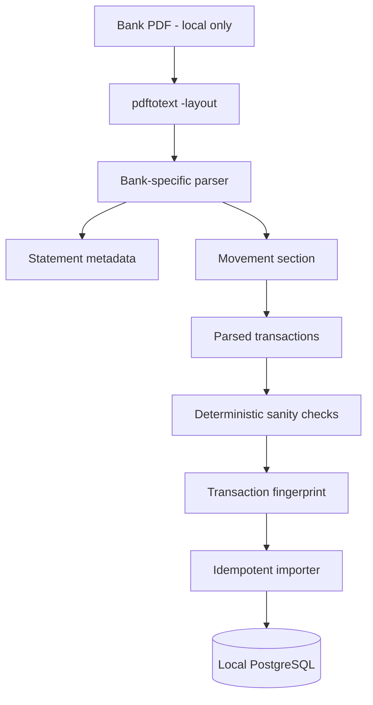
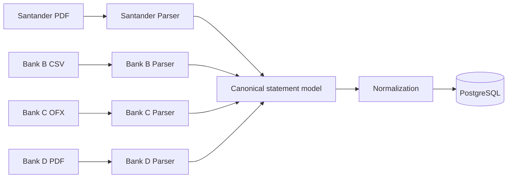

# Financial Data Flow

## Current implemented path

The first implemented financial ingestion path is a Santander bank statement exported as a PDF containing a usable text layer.

## Separation of responsibilities

### PDF/text extraction

External tooling such as Poppler `pdftotext -layout` converts a local PDF into local text. It does not decide what constitutes a financial transaction.

### Bank parser

The bank parser understands the statement layout. It locates statement metadata, identifies transaction sections, parses monetary values, handles multiline descriptions, and rejects suspicious structures.

### Canonical parsed statement

Bank-specific layout details should terminate at the parser boundary. Downstream code should work with normalized Python structures such as `ParsedStatement` and `ParsedTransaction` instead of PDF coordinates or bank-specific text conventions.

### Fingerprint and importer

The importer creates deterministic fingerprints and checks the database before insertion. Re-importing the same statement must not create duplicate transactions.

### PostgreSQL

The local database is the source for later deterministic financial calculations. The LLM does not need database credentials and should not perform financial arithmetic from raw statement text.

## Future multi-bank flow

The parser boundary is deliberate. If Bank B changes its export format, the expected change surface is Bank B's parser plus its synthetic fixtures and tests.
