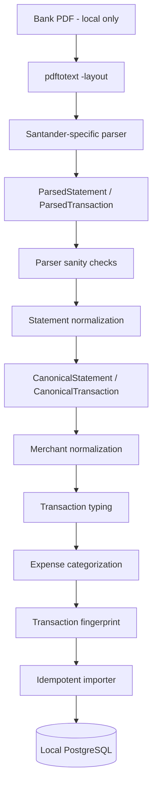
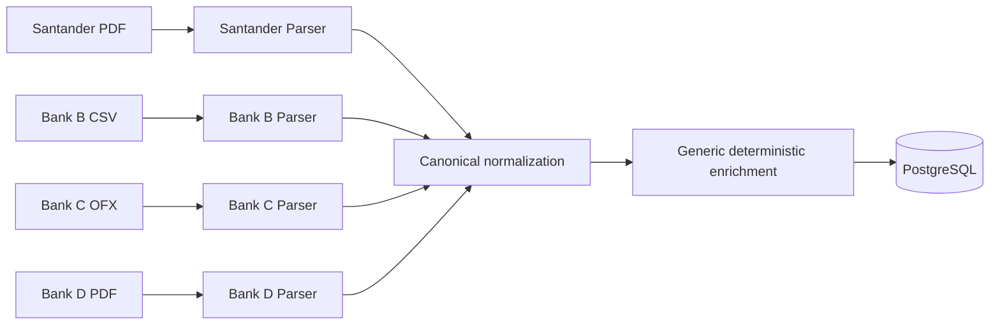

# Financial Data Flow

## Current implemented path

The implemented financial ingestion path begins with a Santander bank statement exported as a PDF containing a usable text layer.



No external AI service participates in this ingestion path.

## Separation of responsibilities

### PDF/text extraction

External tooling such as Poppler `pdftotext -layout` converts a local PDF into local text. It does not decide what constitutes a financial transaction.

### Bank parser

The bank parser understands Santander statement layout. It locates statement metadata, identifies the movement section, parses monetary values, handles multiline descriptions and inherited dates, and rejects suspicious structures.

Bank-specific layout knowledge must terminate at this boundary.

### Statement normalization

`app/ingestion/normalization.py` converts source-specific parsed objects into the canonical financial model.

Normalization may canonicalize representation, such as description whitespace and source metadata, but must not silently alter financial meaning.

### Merchant normalization

`app/ingestion/merchant_normalization.py` derives a normalized merchant only when deterministic patterns recognize one.

Unknown patterns remain `None`. The LLM is not used to guess merchant identity.

### Transaction typing

`app/ingestion/transaction_typing.py` determines the nature of the financial movement.

Current transaction types are:

```text
expense
income
transfer
```

Explicit rules are evaluated first. The current fallback uses the amount sign for ordinary income/expense classification.

### Expense categorization

`app/ingestion/expense_categorization.py` categorizes only transactions already typed as `expense`.

The taxonomy and rule priorities live separately under `app/rules/categories.py`.

Current expense categories are:

```text
food
groceries
transport
utilities
health
shopping
housing
financing
leisure
taxes
```

`income` and `transfer` are not expense categories and therefore keep `category=None`.

### Fingerprint and importer

The importer creates deterministic fingerprints and checks the database before insertion. Re-importing the same statement must not create duplicate transactions.

Merchant, transaction type, and category are derived enrichment fields and do not participate in the fingerprint.

### PostgreSQL

The local database is the source for later deterministic financial calculations. The LLM does not need database credentials and should not perform financial arithmetic from raw statement text.

## Current semantic model

```text
CanonicalTransaction
├── source identity
│   ├── transaction_date
│   ├── amount
│   ├── original_description
│   ├── document
│   ├── statement_month
│   ├── source
│   ├── source_type
│   └── source_account
│
└── deterministic enrichment
    ├── merchant
    ├── transaction_type
    └── category
```

The source identity participates in fingerprint generation. Derived enrichment does not.

## Future multi-bank flow



The parser boundary is deliberate. If one bank changes its export format, the expected change surface is that bank's parser plus its synthetic fixtures and parser tests. Merchant normalization, transaction typing, categorization, fingerprinting, and persistence remain generic downstream stages.
