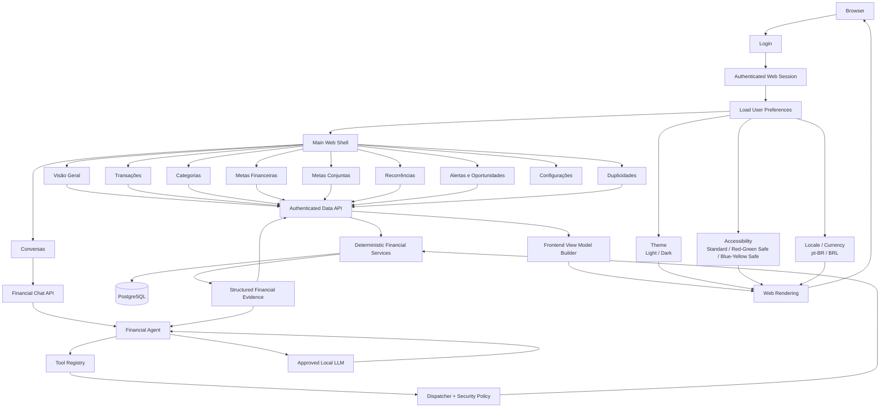
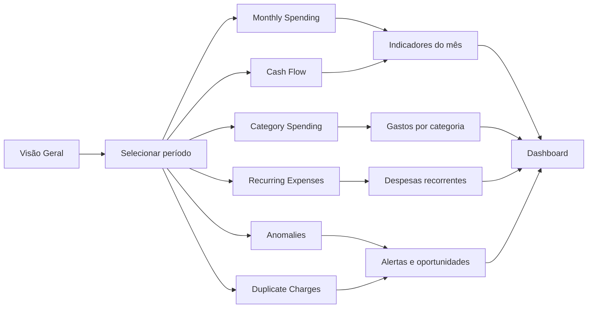
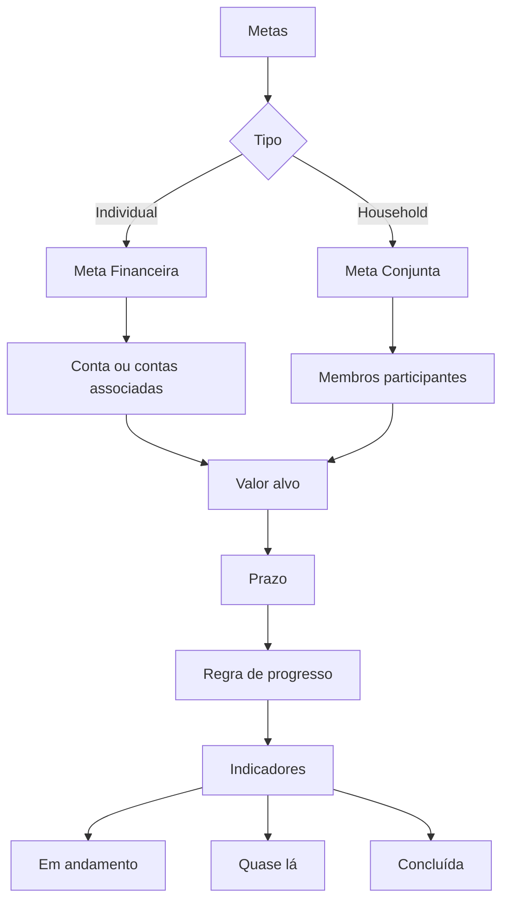
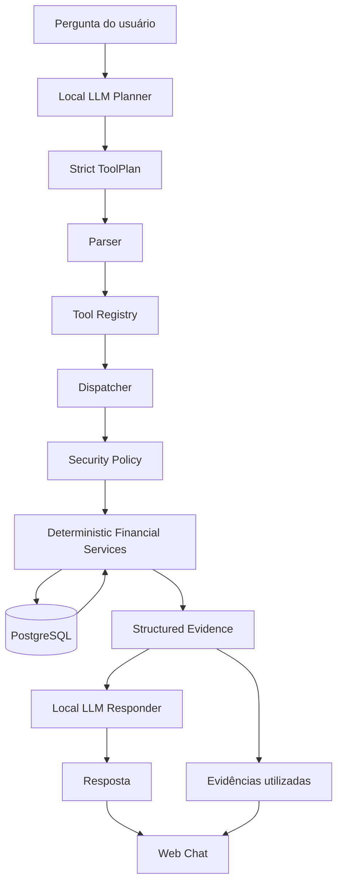
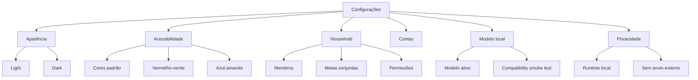

# Sherlock Home Frontend Architecture

Sherlock Home's frontend is the household-facing web interface for the local-first financial system.

The frontend is intentionally documented and planned separately from the backend roadmap. The backend remains responsible for security, persistence, financial calculations, tool execution, authentication, and local AI orchestration. The frontend is responsible for presenting those capabilities in a usable, accessible, non-oppressive household experience.

The current frontend architecture described here is an **approved product and technical direction**, not a claim that the web UI is already implemented.

---

## 1. Design Goals

The web interface should make household finances easier to understand and discuss without turning the experience into a punitive financial-control dashboard.

Primary goals:

- present household financial information clearly;
- keep sensitive household data inside approved local/private infrastructure;
- expose deterministic financial results without duplicating business logic in the browser;
- make local AI assistance understandable and auditable;
- support individual and shared household goals;
- support shared accounts and multiple household members in the UI model;
- provide light and dark modes;
- provide chart palettes for common color-vision accessibility needs;
- avoid relying only on red/green semantics;
- use plain household language instead of corporate OKR/KPI terminology.

The visual direction approved for Sherlock Home uses a friendly detective-boy mascot. The mascot gives the product a lighter tone while preserving the seriousness of privacy and financial correctness.

---

## 2. Frontend and Backend Separation

Sherlock Home must preserve a clear boundary:

```text
Financial data
    ↓
Deterministic backend services
    ↓
Authenticated API
    ↓
Semantic view data
    ↓
Frontend rendering
```

The browser does **not** become a second financial-calculation engine.

The frontend may:

- render totals;
- render charts;
- group already-computed semantic results for presentation;
- format dates and BRL values;
- apply theme and accessibility preferences;
- request deterministic analyses from the API;
- send natural-language questions to the authenticated Sherlock chat endpoint.

The frontend must not:

- calculate authoritative financial totals independently;
- bypass backend authorization;
- invoke financial tools directly;
- call an external LLM directly;
- receive database credentials;
- decide whether protected data may leave the local environment;
- override backend security or tool policy.

---

## 3. High-Level Web Flow



---

## 4. Initial Route Map

The initial information architecture is:

```text
/
/login
/dashboard
/transactions
/categories
/goals
/household-goals
/recurring
/alerts
/duplicates
/chat
/settings
```

Suggested household-facing names:

| Route | UI label |
|---|---|
| `/dashboard` | Visão Geral |
| `/transactions` | Transações |
| `/categories` | Categorias |
| `/goals` | Metas Financeiras |
| `/household-goals` | Metas Conjuntas |
| `/recurring` | Recorrências |
| `/alerts` | Alertas e Oportunidades |
| `/duplicates` | Duplicidades |
| `/chat` | Conversas / Pergunte ao Sherlock |
| `/settings` | Configurações |

The route names describe frontend information architecture. Backend endpoints remain under the authenticated `/api/v1` contract.

---

## 5. Main Web Shell

The approved mockup direction uses:

- dark left navigation rail;
- light mode as the default content theme;
- optional dark mode;
- Sherlock Home mascot and product name in the navigation area;
- local/private runtime indicators;
- period selector;
- household-oriented navigation;
- calm teal, blue, neutral, purple, and warm accents;
- limited use of red, reserved for cases that truly require strong attention.

Suggested navigation:

```text
Visão Geral
Metas Financeiras
Metas Conjuntas
Contas da Casa
Contas Compartilhadas
Indicadores do Mês
Alertas e Oportunidades
Duplicidades
Conversas
Configurações
```

The exact navigation may be simplified as implementation progresses.

---

## 6. Dashboard Flow

The dashboard should be built from deterministic backend evidence.



Initial dashboard sections:

- Indicadores do mês;
- Saúde financeira;
- Gastos por categoria;
- Evolução de gastos;
- Despesas recorrentes;
- Alertas e oportunidades;
- Possíveis duplicidades;
- Contas compartilhadas;
- Pergunte ao Sherlock.

---

## 7. Semantic Data Instead of Chart Images

The backend should return semantic financial data rather than generated chart pixels.

Example:

```json
{
  "metric": "category_spending",
  "currency": "BRL",
  "period": {
    "start": "2026-07-01",
    "end": "2026-08-01"
  },
  "series": [
    {
      "label": "Moradia",
      "value": "1850.00"
    },
    {
      "label": "Supermercado",
      "value": "821.15"
    }
  ]
}
```

The frontend then decides whether that result is displayed as:

- bar chart;
- donut chart;
- table;
- summary card;
- accessible text summary.

This keeps financial semantics separate from presentation.

---

## 8. View Model Boundary

```text
Deterministic Financial Service
        ↓
Semantic Financial Result
        ↓
Authenticated API Contract
        ↓
Frontend View Model Builder
        ↓
User Presentation Preferences
        ↓
Chart / Table / Card Rendering
```

Presentation preferences must never alter financial results.

---

## 9. Theme Modes

Theme is a per-user presentation preference.

Supported initial values:

```text
light
dark
```

### Light mode

Light mode is the default product direction and should preserve:

- neutral background;
- white/light cards;
- calm accent colors;
- strong text contrast;
- minimal alarm-heavy styling.

### Dark mode

Dark mode should preserve the same information hierarchy rather than merely invert colors.

It should use:

- dark teal/navy backgrounds;
- readable card contrast;
- restrained accent colors;
- accessible text and focus states.

---

## 10. Color-Vision Accessibility

Chart accessibility is a user preference.

Initial palette modes:

```text
standard
red_green_safe
blue_yellow_safe
```

Suggested user-facing labels:

```text
Cores dos gráficos

Padrão
Adaptado para dificuldade vermelho/verde
Adaptado para dificuldade azul/amarelo
```

The UI should not require users to know clinical color-vision terminology.

### Do not depend on color alone

Financial meaning must also use:

- icons;
- labels;
- line styles;
- fill patterns;
- symbols;
- text;
- explicit values.

Examples:

```text
▲ aumento
▼ redução
! atenção
◎ meta
▧ possível duplicidade
● categoria
```

A chart should remain interpretable even if all colors are visually similar to the user.

---

## 11. Household Goals

Sherlock Home should translate OKR/KPI-style concepts into household language.

Avoid exposing terms such as:

```text
OKR
KPI
Objective
Key Result
```

unless explicitly requested by an advanced user.

Preferred language:

```text
Metas financeiras
Metas conjuntas
Progresso
Quanto falta
Prazo
Ritmo atual
Indicadores do mês
```

### Individual financial goals

Examples:

```text
Guardar R$ 500 por mês
Reduzir alimentação fora para R$ 400
Montar reserva de R$ 10.000
```

### Shared household goals

Examples:

```text
Guardar R$ 20.000 para uma viagem
Reduzir despesas da casa em 8%
Quitar um financiamento
Criar uma reserva de emergência conjunta
```

### Goal flow



---

## 12. Shared Household Model in the UI

The product direction assumes that more than one person may participate in the same household.

The frontend should therefore be capable of representing:

- household members;
- individual accounts;
- shared accounts;
- accounts visible to selected household members;
- individual goals;
- shared goals;
- household-wide summaries.

This does **not** mean every household permission model is already implemented in the backend.

Until backend authorization supports a specific sharing rule, the frontend must not simulate or imply that permission exists.

Shared-finance UX must eventually make explicit:

- who can see an account;
- who participates in a goal;
- whether a number is individual or household-wide;
- whether a recommendation is personal or shared.

---

## 13. Alerts and Opportunities

The UI should avoid turning every financial deviation into an alarming red event.

Suggested hierarchy:

```text
Informação
Oportunidade
Atenção
Possível duplicidade
Anomalia relevante
```

Examples:

```text
Meta de economia quase lá
Despesa recorrente aumentou
Possível cobrança duplicada
Gasto acima do padrão histórico
Assinatura possivelmente pouco utilizada
```

An anomaly is not the same thing as fraud.

A possible duplicate is not proof of merchant error.

The interface must preserve those distinctions already enforced by the backend evidence contract.

---

## 14. Sherlock Chat Flow



The browser should never call the local model runtime directly.

The authenticated backend remains the authority for:

- planning;
- allowed tools;
- policy enforcement;
- financial evidence;
- LLM invocation;
- final response construction.

---

## 15. Evidence Panel

The web chat should expose a compact expandable panel:

```text
Evidências e ferramentas utilizadas
```

This can show human-readable evidence sources such as:

```text
Gastos por categoria
Análise de anomalias
Possíveis cobranças duplicadas
Comparação mensal
Despesas recorrentes
```

Implementation/tool names may be shown in a technical detail view, but they should not dominate the normal household UX.

The evidence panel exists to improve auditability, not to expose internal implementation unnecessarily.

---

## 16. Settings Flow



---

## 17. User Preferences

A future user-preference model should be able to represent at least:

```text
theme
    light
    dark

chart_palette
    standard
    red_green_safe
    blue_yellow_safe

locale
    pt_BR

currency
    BRL
```

Additional presentation preferences may be added later.

Preferences must not change persisted transaction semantics or deterministic financial calculations.

---

## 18. Initial Holmes-Hat Web Scope

The minimum web experience targeted for `v1.0.0 — Holmes-Hat` should provide a usable browser path to the capabilities already available in the backend.

Minimum target:

- authenticated login;
- main web shell;
- dashboard;
- transaction list;
- category summary;
- recurring-expense view;
- anomaly/alert view;
- duplicate-charge view;
- Sherlock chat;
- local/private runtime indicator;
- light and dark preference;
- basic accessible chart palette preference.

Shared goals and richer household collaboration are part of the frontend architecture, but they should not delay Holmes-Hat if their backend authorization model is not ready.

---

## 19. Frontend Security Boundary

The frontend must preserve existing backend security invariants.

The browser must not bypass:

- authentication;
- authorization;
- CSRF protection;
- source-aware login protections;
- protected configuration controls;
- tool authorization;
- local-model allowlisting;
- protected-data egress policy;
- deterministic financial services.

Protected household data should be rendered only after an authenticated, authorized backend response.

---

## 20. Frontend Architectural Invariants

1. The frontend does not become an authoritative financial-calculation engine.
2. Protected household data remains inside approved local/private boundaries.
3. Browser code does not call external or local LLM runtimes directly.
4. Browser code does not receive database credentials.
5. Authentication, authorization, and CSRF remain backend-enforced.
6. Theme and accessibility settings change presentation only.
7. Charts do not rely on color alone.
8. Financial anomalies are not automatically presented as fraud.
9. Possible duplicates are not automatically presented as merchant error.
10. Shared household information must eventually respect explicit account/member permissions.
11. The UI should favor clarity and collaboration over punitive financial language.
12. Frontend planning remains separate from the backend roadmap.

---

## 21. Related Documentation

Backend/application documentation:

- [`../architecture.md`](../architecture.md)
- [`../ROADMAP.md`](../ROADMAP.md)
- [`../API_V1.md`](../API_V1.md)
- [`../data-safety.md`](../data-safety.md)
- [`../financial-tools.md`](../financial-tools.md)
- [`../financial-evidence-contract.md`](../financial-evidence-contract.md)
- [`../duplicate-charge-detection.md`](../duplicate-charge-detection.md)

Frontend planning:

- [`ROADMAP.md`](ROADMAP.md)
- [`README.md`](README.md)
